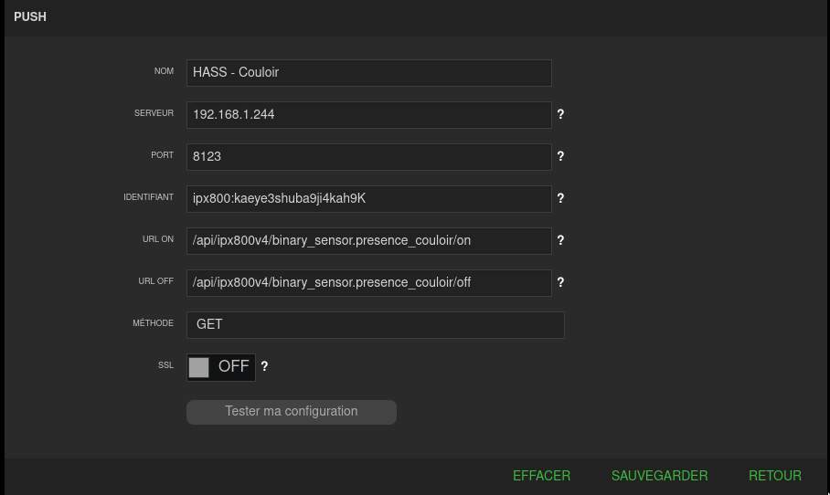
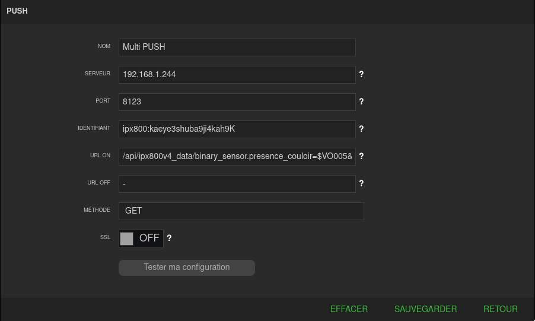
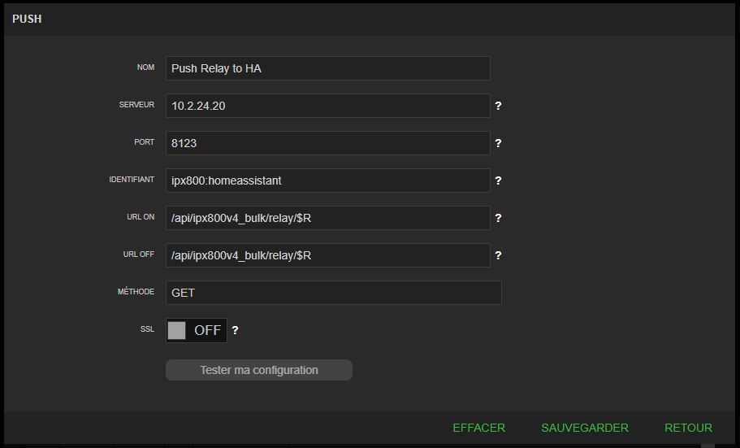

# Component ipx800v4 pour Home Assistant

  [](https://github.com/sponsors/Aohzan) [](https://github.com/hacs/integration)

Il s'agit d'un _custom component_ pour [Home Assistant](https://www.home-assistant.io/).
L'intégration `ipx800v4` vous permet de contrôler et d'obtenir des informations de votre [IPX800 v4 et de ses extensions](http://gce-electronics.com/).

## Diagnostic de l’IPX800

L’équipement général IPX800 contient automatiquement trois entités de diagnostic :

- **Dernier démarrage** : date calculée à partir de l’uptime `wuc0` en secondes et de l’horloge de Home Assistant, indépendamment de l’heure de l’IPX. Elle reste stable dans une tolérance de cinq secondes liée aux requêtes et est recalculée lorsque l’uptime diminue ou que l’écart dépasse cette tolérance.
- **Charge** : valeur brute `lps0`, en cycles par seconde (`loops/s`). Plus elle est basse, plus l’IPX est chargé. Ce n’est **pas un pourcentage CPU**.
- **À l’heure** : activée lorsque la date et l’heure de l’IPX diffèrent de l’heure locale configurée dans Home Assistant de 60 secondes maximum. L’attribut `clock_offset_seconds` donne l’écart signé (IPX moins HA). Les deux appareils doivent utiliser le même fuseau horaire. Il s’agit d’une comparaison des horloges, pas de l’état de la configuration NTP.

L’adresse MAC est également ajoutée aux informations réseau de cet équipement.

Une requête à `/user/status.xml` est effectuée au chargement, puis sur un minuteur séparé suivant le `scan_interval` du YAML (ou sa surcharge dans les options de l’intégration). Les push, commandes et tentatives de récupération des entrées/sorties ne rafraîchissent pas les diagnostics et ne repoussent pas leur minuteur. Une réponse XML lente ou en échec ne retarde pas les mises à jour courantes des entrées/sorties. Aucun ajout à la liste YAML des équipements n’est nécessaire.

### Identifiants pour les informations du contrôleur

Si l’interface web de l’IPX est protégée par un mot de passe, **renseigner `username` et `password` avec les identifiants utilisés pour ouvrir cette interface dans le navigateur**. La clé API JSON seule ne permet pas d’authentifier les requêtes à `/user/status.xml`, qui fournit les informations de démarrage, de charge, d’horloge et d’adresse MAC.

| Paramètre | Utilisation |
| --- | --- |
| `api_key` | Accès à l’API JSON de l’IPX pour les données d’entrées/sorties et les commandes API. |
| `username` / `password` | Identifiants de l’interface web de l’IPX, nécessaires aux diagnostics XML protégés ; également utilisés pour le contrôle X-PWM. |
| `push_password` | Mot de passe distinct choisi pour les push de l’IPX vers Home Assistant. Il n’authentifie pas les diagnostics XML. |

Ajouter les identifiants dans **l’entrée existante de la passerelle IPX**, au même niveau que `host` et `api_key`, et non dans `devices` :

```yaml
ipx800v4:
  - name: IPX800
    host: "192.168.1.240"
    api_key: "votre_cle_api_ipx"
    username: "votre_identifiant_web_ipx"
    password: "votre_mot_de_passe_web_ipx"
    scan_interval: 300
    devices: []  # Conserver ici votre liste d’équipements existante
```

Conserver le nom de la passerelle et la liste des équipements existants. Après modification de `configuration.yaml` (ou du fichier inclus), **redémarrer Home Assistant** pour importer la configuration YAML mise à jour. Les entités de diagnostic sont créées automatiquement sur l’équipement général IPX ; il ne faut pas les ajouter dans `devices`.

Avec `scan_interval: 300`, les diagnostics sont lus au chargement, puis environ toutes les cinq minutes. Un intervalle défini dans les options de l’intégration est prioritaire sur le YAML. Les push ne déclenchent aucune lecture XML.

### Informations absentes ou indisponibles

- Si l’URL XML est accessible sans authentification, `username` et `password` peuvent être omis.
- Si l’accès XML échoue, les trois entités de diagnostic deviennent indisponibles sans invalider les données d’entrées/sorties. La lecture est retentée au prochain cycle de diagnostic ; sans `username` configuré, les requêtes s’arrêtent après cinq échecs consécutifs, jusqu’au rechargement de l’intégration ou au redémarrage de Home Assistant. Une lecture XML réussie remet ce compteur à zéro.
- Avec un `username` configuré, les lectures XML en échec continuent d’être retentées au rythme du minuteur des diagnostics. Vérifier les identifiants web si les informations restent indisponibles.
- Un champ XML absent ou invalide rend uniquement l’entité de diagnostic correspondante indisponible. L’adresse MAC est ajoutée aux informations de l’équipement lorsqu’une valeur valide est reçue.

Si les relais et les entrées fonctionnent mais que les informations du contrôleur sont indisponibles, vérifier d’abord `username` / `password` et les erreurs d’accès XML dans les journaux de l’intégration. `api_key` et `push_password` ne remplacent pas ces identifiants web.


## Installation

### HACS

HACS > Intégrations > Explorer et ajouter des dépôts > GCE IPX800 V4 > Installer ce dépôt dans HACS

### Manually

Copier le dossier `custom_components/ipx800` dans `config/custom_components` de votre installation Home Assistant (vous devez avoir les fichiers `*.py` dans `config/custom_components/ipx800`).
Ajouter l'entrée `ipx800` dans votre fichier `configuration.yml` (voir l'exemple ci-dessous).

Le démarrage de l’intégration nécessite une lecture complète réussie. Si l’IPX800 est injoignable, Home Assistant retente automatiquement la configuration ; les entités ne sont pas disponibles sans données valides.

### Erreurs de communication

Après une lecture réussie, les deux premiers échecs consécutifs de communication conservent les derniers états valides. Chacun programme une nouvelle lecture après `min(scan_interval, 15)` secondes, avec priorité aux options de l’intégration sur le YAML. Le troisième échec rend les entités du coordinateur indisponibles et rétablit le rythme normal. Avec `scan_interval: 300`, les deux reprises sont espacées d’environ 15 secondes, hors durée des requêtes ; avec `scan_interval: 10`, elles restent espacées de 10 secondes.

Toute lecture complète réussie réinitialise immédiatement la reprise, y compris après un push de rafraîchissement (toujours regroupé sur 0,5 seconde) ou une demande manuelle. Les états conservés ne comptent pas comme une acquisition réussie. Les erreurs d’authentification/configuration ne bénéficient pas de cette tolérance et ce mécanisme ne rejoue aucune commande. Aucune nouvelle option YAML n’est nécessaire.

### Champs temporairement absents

Si une réponse réussie omet un champ d’entrée/sortie ou d’extension auparavant valide (ou contient une valeur invalide), seul ce champ entre en récupération. Sa dernière valeur est conservée au maximum pendant deux lectures réussies supplémentaires ou `2 × min(scan_interval, 15)` secondes après la première absence détectée, selon la première limite atteinte. Cela représente au plus 30 secondes avec `scan_interval: 300`. Tous les champs absents partagent la planification des reprises de communication ; les échecs HTTP ne comptent pas comme des constats d’absence. L’expiration est publiée même si aucune lecture suivante ne réussit.

Seules les entités dépendant d’un champ expiré deviennent indisponibles ; les autres continuent de recevoir leurs valeurs actuelles. Un champ jamais reçu reste indisponible. Le rythme normal reprend après la récupération, même pour une extension durablement absente. Une lecture ou un push valide rétablit immédiatement les champs reçus, sans renouveler les autres. Cette politique concerne les entités d’entrées/sorties et d’extensions configurées ; les diagnostics XML gardent leur comportement distinct décrit plus haut.

## Dépendances

[pypix800 python package](https://github.com/Aohzan/pypx800) (installé par Home-Assistant directement, rien à faire de votre côté)

## Description

Vous pouvez contrôller ces types d'appareil :

- `relay` en tant que switch, light ou climate (avec https://www.gce-electronics.com/fr/nos-produits/314-module-diode-fil-pilote-.html)
- `virtualout` en tant que switch et binarysensor
- `virtualin` en tant que switch
- `digitalin` en tant que binarysensor
- `analogin` en tant que sensor
- `xdimmer` en tant que light
- `xpwm` en tant que light
- `xpwm_rgb` en tant que light (utilise 3 canaux xpwm)
- `xpwm_rgbw` en tant que light (utilise 4 canaux xpwm)
- `x4vr` en tant que cover
- `x4vr_bso` en tant que cover avec support du BSO
- `xthl` en tant que sensors
- `x4fp` en tant que climate

## Push état depuis l'IPX800

Premièrement, si vous souhaitez poussez des états depuis votre IPX800, vous devez choisir un mot de passe et le préciser dans le paramètre `push_password` de votre configuration.
Ensuite, dans la configuration PUSH de l'IPX800, dans le champ `Identifiant`, mettez `ipx800:monmotdepasse` (avec la même valeur que le paramètre défini après le `:`).

En faisant un appel PUSH depuis l'IPX sur l'URL `/api/ipx800v4_refresh/on`, vous demandez à Home-Assistant de rafraichir l'état des entrées/sorties de l'IPX800 V4, hors diagnostics XML.

Vous pouvez mettre à jour la valeur d'une entité en définissant une commande Push dans l'IPX800 via un scénario.
Utile pour mettre à jour directement un binary_sensor ou un  switch sans attendre la prochaine récupération d'état.
Dans `URL ON` et `URL_OFF` mettre `/api/ipx800/entity_id/state`:



Vous pouvez également mettre à jour plusieurs entités depuis une seule commande push (voir le wiki officiel : https://wiki.gce-electronics.com/index.php?title=API_V4#Inclure_des_.C3.A9tiquettes_dans_les_notifications_.28mail.2C_push_et_GSM.29)

Vous devez mettre au format `entity_id=$XXYY` séparé par un `&`, exemple : `/api/ipx800v4_data/binary_sensor.presence_couloir=$VO005&light.spots_couloir=$XPWM06`.



Enfin, vous pouvez également mettre à jour les états de toutes les entités d'un seul bloc. Par exemple pour mettre à jour les états de tous les relais à partir de l'IPX800v4 : `/api/ipx800v4_bulk/relay/$R`.



Les étiquettes testées sont les suivantes :

- Relais : `/api/ipx800v4_bulk/relay/$R`
- Entrée numérique : `/api/ipx800v4_bulk/digitalin/$D`
- Entrée virtuelle : `/api/ipx800v4_bulk/virtualin/$VI`
- Sortie virtuelle : `/api/ipx800v4_bulk/virtualout/$VO`

Voir le wiki officiel pour [plus d'informations](https://wiki.gce-electronics.com/index.php?title=API_V4#Inclure_des_.C3.A9tiquettes_dans_les_notifications_.28mail.2C_push_et_GSM.29).

Si vous avez plusieurs entrées IPX dans votre configuration, vous pouvez spécifier le nom de l'IPX dans la route : `/api/ipx800v4_bulk/<MY_IPX_NAME>/relay/$R`.

Ce paramètre dans l'URL est également disponible pour chaque route décrite ci-dessus :

- `/api/ipx800v4_refresh/<MY_IPX_NAME>/on` : vous demandez une mise à jour du statut des entrées/sorties de l'IPX800 nommé "MY_IPX_NAME"
- `/api/ipx800v4/<MY_IPX_NAME>/entity_id/state` : vous mettez à jour le statut de l'"entity_id" sur l'IPX nommé "MY_IPX_NAME"
- `/api/ipx800v4_data/<MY_IPX_NAME>/binary_sensor.presence_couloir=$VO005&light.spots_couloir=$XPWM06` : vous mettez à jour les statuts de plusieurs entités sur l'IPX nommée MY_IPX_NAME
- `/api/ipx800v4_bulk/<MY_IPX_NAME>/relay/$R` : vous mettez à jour les statuts de tous les relais sur l'IPX nommé MY_IPX_NAME

## Exemple et paramètres de configuration

[Sur le README original](README.md)

Les routes push utilisent la configuration active de l’IPX à chaque requête. Recharger un contrôleur met à jour ses identifiants, sa liste d’équipements et son coordinateur sans remplacer les routes d’un autre IPX. Les requêtes vers un contrôleur déchargé sont refusées. Les URL existantes avec ou sans nom restent compatibles ; une URL sans nom doit identifier un seul IPX chargé grâce aux identifiants et à la vérification de l’hôte. Si plusieurs IPX correspondent, utiliser l’URL contenant le nom de l’IPX.


### Valeurs et disponibilité des push directs

Les push directs mettent à jour les champs du coordinateur puis publient normalement les entités. Les URL individuelles et `_data` utilisent les identifiants actuels du registre, y compris après renommage, et acceptent uniquement les entités chargées de l’IPX authentifié. Un lot mal formé, une valeur invalide, des valeurs contradictoires pour un même champ ou une cible étrangère entraînent le rejet complet de la requête.

- Les capteurs binaires, interrupteurs et lumières sur relais acceptent `on/off`, `true/false` et `1/0` comme états d’entité. L’inversion des capteurs binaires est convertie vers la valeur brute puis appliquée normalement à l’affichage. Les interrupteurs et lumières sur relais conservent leur fonctionnement sans inversion.
- Les capteurs et nombres acceptent des valeurs numériques finies. Une lumière PWM à un canal accepte son pourcentage IPX réel (0–100), ou `off/false` pour zéro. La valeur `on` seule ne fournit pas le niveau PWM.
- Les URL bulk conservent leurs chaînes de bits bruts pour les relais, entrées numériques, entrées virtuelles et sorties virtuelles. L’inversion des capteurs binaires est appliquée uniquement par l’entité.
- Les états composites ou ambigus (volets, climats, dimmers, lumières RGB/RGBW) nécessitent l’URL de rafraîchissement existante. Une chaîne d’état seule ne permet pas de reconstruire fidèlement leurs données. Les valeurs non prises en charge renvoient HTTP 400 ; les entités inconnues, déchargées ou étrangères renvoient HTTP 404.

Un push valide actualise uniquement la fraîcheur des champs reçus. Il ne remet pas à zéro les erreurs de lecture et ne décale ni le polling ni les tentatives de récupération. Pendant une panne de lecture, une entité reste disponible uniquement si **tous** ses champs nécessaires ont reçu un push récent. Cette fraîcheur expire après `scan_interval + 2 × min(scan_interval, 15)` secondes, soit 330 secondes pour un intervalle de 300 secondes. L’expiration est publiée même si les lectures échouent toujours.

Une lecture complète réussie réconcilie les données. Un push reçu pendant une lecture en cours prime sur sa réponse ; la lecture réussie suivante le réconcilie normalement. L’URL refresh demande toujours une lecture complète avec regroupement des appels, et les commandes attendent toujours des données confirmées.


## Réessais des commandes

Les commandes d’état ou de valeur explicite réessaient les erreurs de communication
transitoires au maximum deux fois : attente non bloquante de 1 puis 2 secondes,
soit trois tentatives par écriture. Cela concerne ON/OFF des relais et entrées/sorties
virtuelles, les niveaux dimmer/PWM, les canaux RGB/RGBW, les modes de chauffage
et les valeurs analogiques virtuelles. Les timeouts (lecture du corps de réponse comprise), les réponses sans confirmation
de succès et les contenus inattendus ou mal formés sont réessayés. Les erreurs
d’authentification, URL invalides et erreurs HTTP définitives ne sont pas réessayées.
L’erreur finale précise la cause, le type d’exception et le nombre réel de tentatives
et de réessais pour l’écriture en échec. Une lecture en échec
après une écriture réussie ne rejoue jamais l’écriture. L’échec final remonte
à l’automatisation sous forme de `HomeAssistantError`.

Pour X4VR, ouverture/fermeture envoient une position absolue 0/100, le positionnement
une cible absolue et le stop la valeur 101 : ces commandes peuvent être réessayées.
L’inclinaison BSO utilise des impulsions relatives et n’est jamais réessayée.
Voir l’[API GCE](https://wiki.gce-electronics.com/index.php?title=API_V4).
Les basculements (`toggle`) et écritures de compteurs restent également à un seul envoi.

Une nouvelle commande sur une sortie commune annule les anciens réessais en attente
et les écritures de canaux restantes, même entre plusieurs entités représentant la
même sortie. Une requête déjà en cours termine avant la nouvelle écriture ; les
pauses libèrent les verrous. L’ancien appel reçoit alors une erreur indiquant qu’il
a été remplacé. Le déchargement de l’intégration arrête les réessais en attente.
Une transition peut repartir si la première réponse a été perdue ; une réponse API
réussie confirme la requête, pas la fin du mouvement physique.

Pour une sortie déclenchant une impulsion, une temporisation ou un scénario IPX,
ajouter `retry_commands: false` dans la configuration YAML de cet équipement si
répéter ON/OFF a des effets secondaires. Par défaut, l’option vaut `true` et concerne
uniquement les commandes éligibles ci-dessus, jamais les toggles ou impulsions.
Le gestionnaire ne peut pas ordonner les commandes manuelles ou scénarios externes à HA.

Le client de commandes conserve `request_retries=1`. Son chemin CGI évite le
`time.sleep()` bloquant de pypx800 2.5.1 ; les réessais utilisent `await asyncio.sleep()`.
