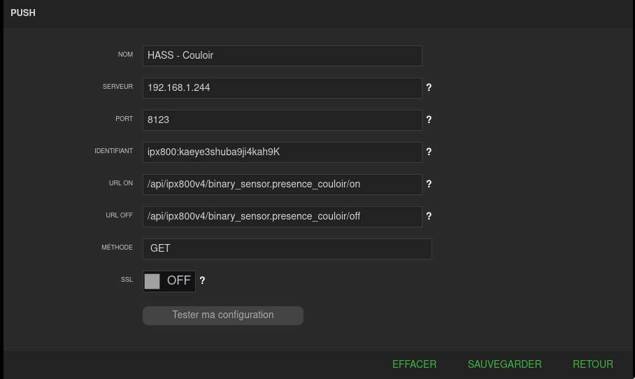
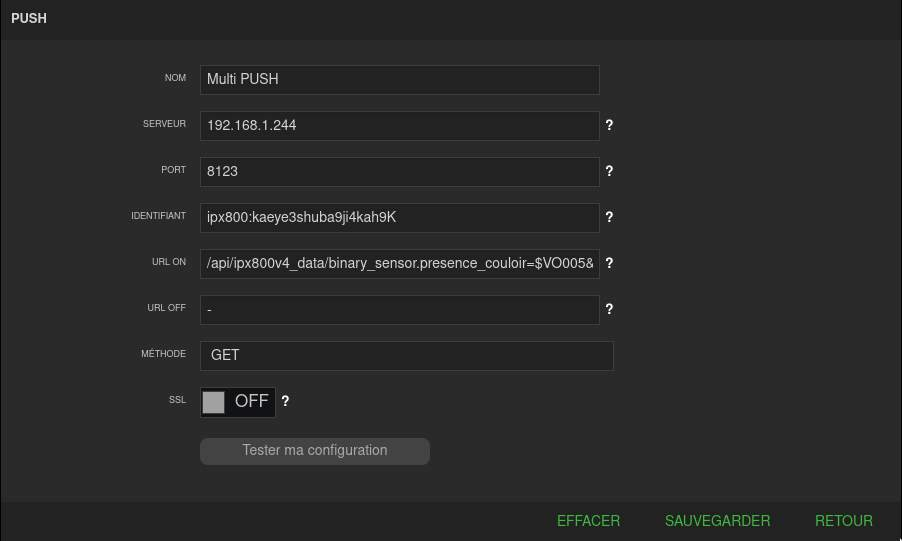
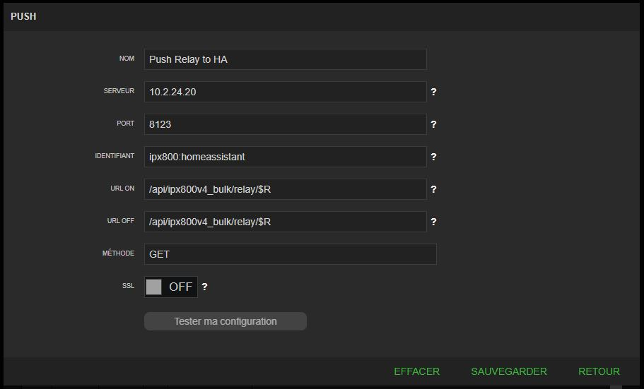

# Component ipx800v4 pour Home Assistant

   

Il s'agit d'un _custom component_ pour [Home Assistant](https://www.home-assistant.io/).
L'intégration `ipx800v4` vous permet de contrôler et d'obtenir des informations de votre [IPX800 v4 et de ses extensions](http://gce-electronics.com/).

## Installation

### HACS

HACS > Intégrations > Explorer et ajouter des dépôts > GCE IPX800 V4 > Installer ce dépôt dans HACS

### Manually

Copier le dossier `custom_components/ipx800` dans `config/custom_components` de votre installation Home Assistant (vous devez avoir les fichiers `*.py` dans `config/custom_components/ipx800`).
Ajouter l'entrée `ipx800` dans votre fichier `configuration.yml` (voir l'exemple ci-dessous).

L'IPX800 doit être disponible pendant le démarrage d'Home Assistant.
Si vous avez un autre système domotique qui communiquer avec l'IPX800, comme Jeedom, désactivez le pendant le démarrage d'Home Assistant, afin d'être sûr qu'il puisse répondre aux requêtes.

## Dépendances

[pypix800 python package](https://github.com/Aohzan/pypx800) (installé par Home-Assistant directement, rien à faire de votre côté)

## Description

Vous pouvez contrôller ces types d'appareil :

- `relay` en tant que switch, light ou climate (avec https://www.gce-electronics.com/fr/nos-produits/314-module-diode-fil-pilote-.html)
- `virtualout` en tant que switch et binarysensor
- `virtualin` en tant que switch
- `digitalin` en tant que binarysensor
- `analogin` en tant que sensor
- `xdimmer` en tant que light
- `xpwm` en tant que light
- `xpwm_rgb` en tant que light (utilise 3 canaux xpwm)
- `xpwm_rgbw` en tant que light (utilise 4 canaux xpwm)
- `x4vr` en tant que cover
- `x4vr_bso` en tant que cover avec support du BSO
- `xthl` en tant que sensors
- `x4fp` en tant que climate

## Push état depuis l'IPX800

Premièrement, si vous souhaitez poussez des états depuis votre IPX800, vous devez choisir un mot de passe et le préciser dans le paramètre `push_password` de votre configuration.
Ensuite, dans la configuration PUSH de l'IPX800, dans le champ `Identifiant`, mettez `ipx800:monmotdepasse` (avec la même valeur que le paramètre défini après le `:`).

En faisant un appel PUSH depuis l'IPX sur l'URL `/api/ipx800v4_refresh/on`, vous demandez à Home-Assistant de rafraichir l'état de toutes les entités de l'IPX800 V4.

Vous pouvez mettre à jour la valeur d'une entité en définissant une commande Push dans l'IPX800 via un scénario.
Utile pour mettre à jour directement un binary_sensor ou un  switch sans attendre la prochaine récupération d'état.
Dans `URL ON` et `URL_OFF` mettre `/api/ipx800/entity_id/state`:

Vous pouvez également mettre à jour plusieurs entités depuis une seule commande push (voir le wiki officiel : https://wiki.gce-electronics.com/index.php?title=API_V4#Inclure_des_.C3.A9tiquettes_dans_les_notifications_.28mail.2C_push_et_GSM.29)

Vous devez mettre au format `entity_id=$XXYY` séparé par un `&`, exemple : `/api/ipx800v4_data/binary_sensor.presence_couloir=$VO005&light.spots_couloir=$XPWM06`.

Enfin, vous pouvez également mettre à jour les états de toutes les entités d'un seul bloc. Par exemple pour mettre à jour les états de tous les relais à partir de l'IPX800v4 : `/api/ipx800v4_bulk/relay/$R`.

Les étiquettes testées sont les suivantes :

- Relais : `/api/ipx800v4_bulk/relay/$R`
- Entrée numérique : `/api/ipx800v4_bulk/digitalin/$D`
- Entrée virtuelle : `/api/ipx800v4_bulk/virtualin/$VI`
- Sortie virtuelle : `/api/ipx800v4_bulk/virtualout/$VO`

Voir le wiki officiel pour [plus d'informations](https://wiki.gce-electronics.com/index.php?title=API_V4#Inclure_des_.C3.A9tiquettes_dans_les_notifications_.28mail.2C_push_et_GSM.29).

Si vous avez plusieurs entrées IPX dans votre configuration, vous pouvez spécifier le nom de l'IPX dans la route : `/api/ipx800v4_bulk/<MY_IPX_NAME>/relay/$R`.

Ce paramètre dans l'URL est également disponible pour chaque route décrite ci-dessus :

- `/api/ipx800v4_refresh/<MY_IPX_NAME>/on` : vous demandez une mise à jour du statut de toutes les entités de l'IPX800 nommées "MY_IPX_NAME"
- `/api/ipx800v4/<MY_IPX_NAME>/entity_id/state` : vous mettez à jour le statut de l'"entity_id" sur l'IPX nommé "MY_IPX_NAME"
- `/api/ipx800v4_data/<MY_IPX_NAME>/binary_sensor.presence_couloir=$VO005&light.spots_couloir=$XPWM06` : vous mettez à jour les statuts de plusieurs entités sur l'IPX nommée MY_IPX_NAME
- `/api/ipx800v4_bulk/<MY_IPX_NAME>/relay/$R` : vous mettez à jour les statuts de tous les relais sur l'IPX nommé MY_IPX_NAME

## Exemple et paramètres de configuration

[Sur le README original](README.md)
