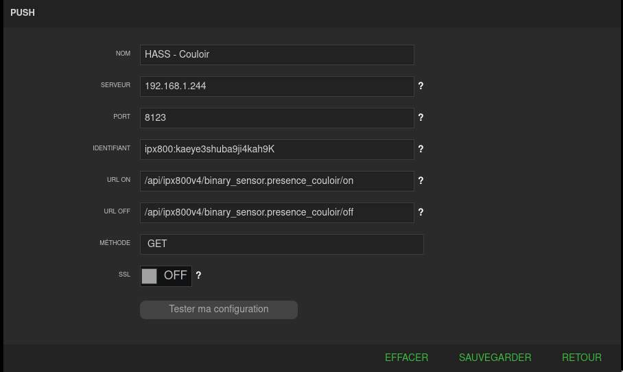
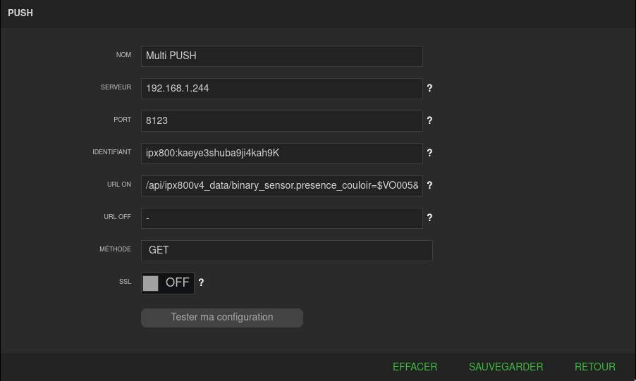
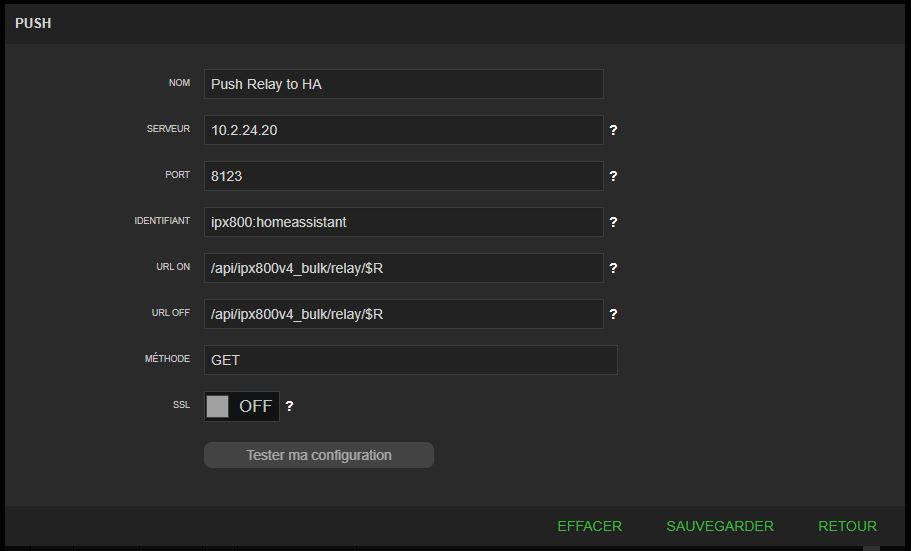

# ipx800v4 component for Home Assistant

  [](https://github.com/sponsors/Aohzan) [](https://github.com/hacs/integration)

This a _custom component_ for [Home Assistant](https://www.home-assistant.io/).
The `ipx800v4` integration allows you to get information and control the [IPX800 v4 and its extensions](http://gce-electronics.com/).

 :fr:

## Installation

### HACS

HACS > Integrations > Explore & Add Repositories > GCE IPX800 V4 > Install this repository

### Manually

Copy `custom_components/ipx800` in `config/custom_components` of your Home Assistant (you must have `*.py` files in `config/custom_components/ipx800v4`).
Add the `ipx800v4` entry in your `configuration.yml` (see example below).

The IPX800 must be available during Home Assistant start. If you have an other home automation system which query the IPX800, like Jeedom, disable it during start to ensure it will respond to requests.

## Description

You can control by setting the type of the device:

- `relay` as switch and light or climate (with https://www.gce-electronics.com/fr/nos-produits/314-module-diode-fil-pilote-.html)
- `virtualout` as switch and binarysensor
- `virtualin` as switch
- `digitalin` as binarysensor
- `analogin` as sensor
- `virtualanalogin` as sensor or number
- `xdimmer` as light
- `xeno` as sensor
- `xpwm` as light
- `xpwm_rgb` as light (use 3 xpwm channels)
- `xpwm_rgbw` as light (use 4 xpwm channels)
- `x4vr` as cover
- `x4vr_bso` as cover with BSO/tilt support
- `xthl` as sensors
- `x4fp` as climate
- `counter` as sensor or number

## Example

```yaml
# Example configuration.yaml entry
ipx800v4:
  - name: IPX800
    host: "192.168.1.240"
    api_key: "apikey"
    devices:
      - name: Chaudière
        icon: mdi:water-boiler
        type: "relay"
        component: "switch"
        id: 3
      - name: Lumière Garage
        type: relay
        component: light
        id: 9
      - name: Lumière Salle à Manger
        type: xdimmer
        component: light
        id: 1
      - component: light
        name: Spots Cuisine
        type: xpwm
        id: 1
      - component: light
        name: "Bandeau de LED Salon"
        type: xpwm_rgbw
        ids: [9, 10, 11, 12]
        transition: 1.5
      - component: binary_sensor
        device_class: motion
        name: Présence Cuisine
        type: virtualout
        id: 1
      - component: binary_sensor
        name: Sonnette
        type: digitalin
        icon: mdi:bell-circle-outline
        id: 1
      - component: binary_sensor
        name: Porte garage
        type: digitalin
        icon: mdi:garage
        id: 2
        invert_value: true
      - component: sensor
        device_class: illuminance
        name: Luminosité Cuisine
        icon: mdi:white-balance-sunny
        type: analogin
        id: 1
        unit_of_measurement: "lx"
      - component: sensor
        name: Capteur Rez-de-Chaussée
        type: xthl
        id: 1
      - component: cover
        name: Volet Salon
        type: x4vr
        ext_id: 1
        id: 1
      - component: climate
        name: Radiateur Salon
        type: x4fp
        ext_id: 1
        id: 1
      - component: climate
        name: Radiateur Salle de Bains
        type: relay
        ids: [7, 8]
      - component: number
        name: Compteur
        type: counter
        id: 1
      - component: sensor
        device_class: humidity
        name: Humidité Salle de Bains
        type: xeno
        id: 123
        unit_of_measurement: "%"
      - component: sensor
        device_class: temperature
        name: Température Salle de Bains
        type: xeno
        id: 124
        unit_of_measurement: "C"
```

## List of configuration parameters

```yaml
name:
  description: Name of the IPX800.
  required: true
  type: name
host:
  description: Hostname or IP address of the IPX800.
  required: true
  type: host
port:
  description: HTTP port.
  required: false
  default: 80
  type: port
api_key:
  description: API key (need to be activate in Network => API)
  required: true
  type: string
username:
  description: Username (for X-PWM control only)
  required: false
  type: string
password:
  description: User's password (for X-PWM control only)
  required: false
  type: string
scan_interval:
  description: Time in seconds between two polling, small value can cause error from the IPX800
  required: false
  default: 10
  type: int
push_password:
  description: Define a password to allow API calls from IPX800 PUSH
  required: false
  type: string
devices:
  description: List of your devices configuration (switch of relays, light of X-Dimmer...), see below
  required: true
  type: list
```

### Devices configuration

```yaml
component:
  description: device type
  required: true
  type: string
  values: "switch", "light", "cover", "sensor" or "binary_sensor"
name:
  description: friendly name of the device
  required: true
  type: string
device_class:
  description: custom device_class for binary_sensor and sensor only, see Home Assistant
  required: false
  type: string
unit_of_measurement:
  description: set a unit of measurement for sensor only
  required: false
  type: string
transition:
  description: transition time in millisecond, for lights only trough X-Dimmer or X-PWM
  required: false
  default: 500
  type: int
icon:
  description: custom icon
  required: false
  type: string
# Type to control/Get value, only one otherwise the device will not be added
type:
  description: type of input/output on the IPX800 or an extension.
  required: true
  type: string
  values: "relay", "analogin", "virtualanalogin", "digitalin", "virtualin", "virtualout", "xdimmer", "xpwm", "xpwm_rgb", "xpwm_rgbw", "xthl", "x4vr", "x4fp", "relay_fp", "counter"
id:
  description: id of type output, required for all except xpwm_rgb and xpwm_rgbw type
  required: false
  type: int
ext_id:
  description: id of X-4VR extension, required only for x4vr and x4fp type
  required: false
  type: int
ids:
  description: ids of channel for xpwm_rgb, xpwm_rgbw type or relay as climate component
  required: false
  type: list of int
default_brightness:
  description: default brightness for xpwm, xpwm_rgb and xpwm_rgbw only for turn on command (must be between 1 and 255)
  required: false
  type: int
invert_value:
  description: invert the value returned for binary_sensors (on become off and vice versa)
  required: false
  type: bool
  default: false
```

## Push data from the IPX800

First, if you want to push data from your IPX800, you have to set a password on `push_password` config parameter.
Then in your IPX800 PUSH configuration, in the `Identifiant` field, set : `ipx800:mypassword`.

By calling the URL `/api/ipx800v4_refresh/on` from the IPX800, you ask a state refresh from all IPX800 entities.

You can update value of a entity by set a Push command in a IPX800 scenario. Usefull to update directly binary_sensor and switch.
In `URL ON` and `URL_OFF` set `/api/ipx800v4/entity_id/state`:



You can update values of multiple entities with one request (see official wiki: https://wiki.gce-electronics.com/index.php?title=API_V4#Inclure_des_.C3.A9tiquettes_dans_les_notifications_.28mail.2C_push_et_GSM.29)

You have to set the `entity_id=$XXYY` separate by a `&`, example : `/api/ipx800v4_data/binary_sensor.presence_couloir=$VO005&light.spots_couloir=$XPWM06`.



Finally, you can also push the states of all IPX entities directly and without naming them using bulk update. For example to update all relays from the IPX800v4 : `/api/ipx800v4_bulk/relay/$R`.



The labels tested are as follows:

-  Relays: `/api/ipx800v4_bulk/relay/$R`
- Digital In: `/api/ipx800v4_bulk/digitalin/$D`
- Virtual In: `/api/ipx800v4_bulk/virtualin/$VI`
- Virtual Out: `/api/ipx800v4_bulk/virtualout/$VO`

See official wiki for [more information](https://wiki.gce-electronics.com/index.php?title=API_V4#Inclure_des_.C3.A9tiquettes_dans_les_notifications_.28mail.2C_push_et_GSM.29).

In case you have multiple IPX entries in your configuration, you can specify the name of the IPX in the route: `/api/ipx800v4_bulk/<MY_IPX_NAME>/relay/$R`.

This parameter in the URL is also available for each routes described above:

- `/api/ipx800v4_refresh/<MY_IPX_NAME>/on` : you request a status update to all entities of the IPX800 named "MY_IPX_NAME"
-  `/api/ipx800v4/<MY_IPX_NAME>/entity_id/state` : you update the status of the "entity_id" on the IPX named "MY_IPX_NAME"
- `/api/ipx800v4_data/<MY_IPX_NAME>/binary_sensor.presence_couloir=$VO005&light.spots_couloir=$XPWM06` : you update the statuses of several entities on the IPX named MY_IPX_NAME
- `/api/ipx800v4_bulk/<MY_IPX_NAME>/relay/$R` : you update the statuses of all relays on the IPX named MY_IPX_NAME

## Dependency

[pypix800 python package](https://github.com/Aohzan/pypx800) (installed by Home-Assistant itself, nothing to do here)
