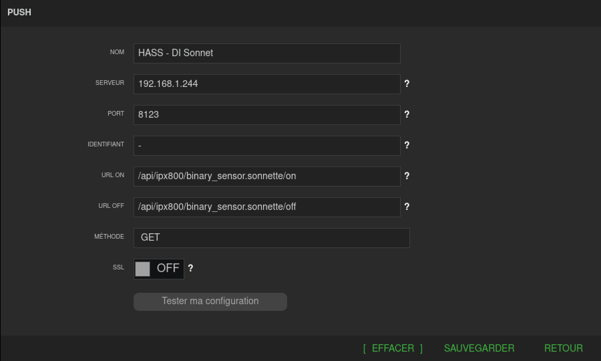

# ipx800 component for Home Assistant
This a *custom component* for [Home Assistant](https://www.home-assistant.io/). 
The `ipx800` integration allows you to get information from [GCE Eco-Devices](http://gce-electronics.com/).

### Requirement
[pypix800 python package](https://github.com/Aohzan/pypx800)

### Description
You can control by setting the component parameter for each device:
* `relay` as switch and light
* `virtual output` as switch and binarysensor
* `virtual in` as switch
* `digital in` as binarysensor
* `analog` in as sensor
* `xdimmer` as light
* `xpwm` as light
* `xpwm rgb` as light (use 3 xpwm channels)
* `xpwm rgbw` as light (use 4 xpwm channels)

Currently, an API call is done by device, so the IPX800 can receive a lot of request, set `should_poll` to false when it's possible.

You can update value of a device by set a Push command in a IPX800 scenario. Usefull to update directly binary_sensor and switch.
In `URL ON` and `URL_OFF` set `/api/ipx800/entity_id/state`:



### Example
```yaml
# Example configuration.yaml entry
ipx800:
  gateways:
    - host: "192.168.1.240"
      api_key: "apikey"
      username: user
      password: password
      scan_interval: 90
      devices_config:
        switch_porte_garage:
          component: switch
          name: Porte Garage
          icon: mdi:car
          relay: 1
          should_poll: false
        lumiere_terrasse:
          component: light
          name: "Lumière Terrasse"
          relay: 11
        spots_salle_de_bains:
          component: light
          name: "Spots Salle de Bains"
          xpwm: 8
          transition: 1.5
        led_salon:
          component: light
          name: "Bandeau de LED Salon"
          xpwm_rgbw: [9, 10, 11, 12]
          transition: 2
        switch_ipx800_automatique:
          component: switch
          name: IPX800 Mode Automatique
          icon: mdi:pause-circle
          virtualin: 1
          should_poll: false
        switch_presence_cuisine:
          component: binary_sensor
          device_class: motion
          name: Présence Cuisine
          virtualout: 1
          should_poll: false
        sensor_sonnette:
          component: binary_sensor
          name: Sonnette
          icon: mdi:bell-circle-outline
          digitalin: 1
          should_poll: false
        sensor_luminosite_cuisine:
          component: sensor
          device_class: illuminance
          name: Luminosité Cuisine
          icon: mdi:white-balance-sunny
          analogin: 1
          unit_of_measurement: "lx"
```

### List of configuration parameters
```yaml

host:
  description: Hostname or IP address of the IPX800.
  required: true
  type: host
port:
  description: HTTP port.
  required: false
  default: 80
  type: port
api_key:
  description: API key (need to be activate in Network => API)
  required: true
  type: string
username:
  description: Username (for X-PWM control only)
  required: false
  default: VA
  type: string
password:
  description: User's password (for X-PWM control only)
  required: false
  type: string
devices_config:
  component: 
    description: device type
    required: true
    type: string
    values: "switch", "light", "sensor" or "binary_sensor"
  name:
    description: friendly name of the device     
    required: true
    type: string
  device_class:
    description: custom device_class for sensor only, see Home Assistant
    required: false
    type: string
  unit_of_measurement:
    description: set a unit of measurement for sensor only
    required: false
    type: string
  transition:
    description: transition time in millisecond, for lights only trough X-Dimmer or X-PWM
    required: false
    default: 500
    type: int
  icon:
    description: custom icon
    required: false
    type: string
  should_poll:
    description: set to false if you don't need that this entity is updated, usefull to reduce api call numbers
    required: false
    default: true
    type: boolean
  # Type to control/Get value, only one otherwise the device will not be added
  relay:
    description: relay id of IPX800 (1-8) or X-8R (9+)
    required: false
    type: int
  analogin:
    description: analog input number of IPX800 (1-4)
    required: false
    type: int
  digitalin:
    description: digital input number of IPX800 (1-8), X-8D and X-24D (9+)
    required: false
    type: int
  virtualin:
    description: virtual input number of IPX800
    required: false
    type: int
  virtualout:
    description: virtual output number of IPX800
    required: false
    type: int
  xdimmer:
    description: relay id of X-Dimmer
    required: false
    type: int
  xpwm:
    description: channel id of X-PWM
    required: false
    type: int
  xpwm_rgb:
    description: 3 channels id of X-PWM to get a RGB light
    required: false
    type: array of int
  xpwm_rgbw:
    description: 4 channels id of X-PWM to get a RGBW light
    required: false
    type: array of int

```